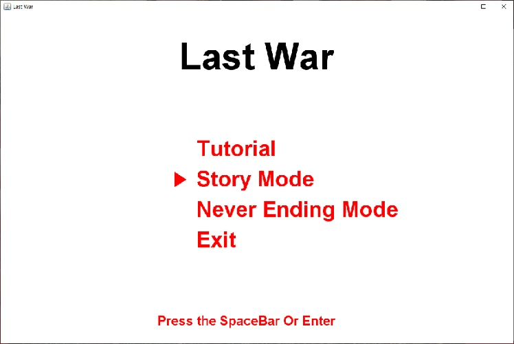
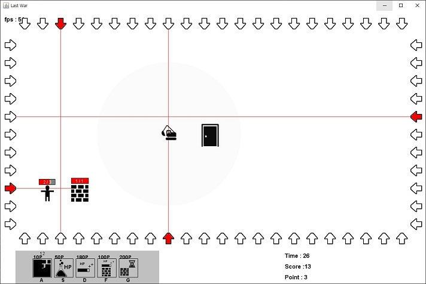
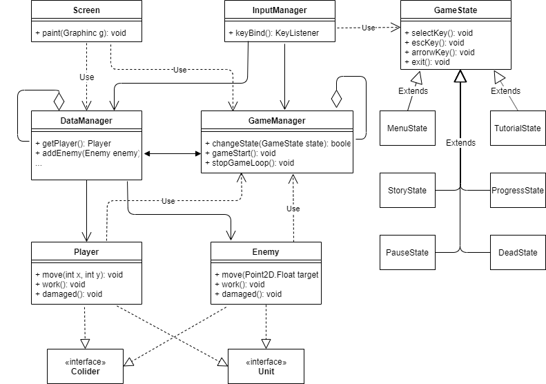

# LastWar
## 개요
2d 탑뷰이며 사방에서 쏟아지는 레이저를 회피하면서 적을 처치하는 게임입니다.

주인공 Brickson이 자신을 처리하기 위해 쫓아오는 건설 로봇들을 레이저가 쏟아져 나오는
방으로 유인하여 처리하고 살아남기 위해 고군분투하는 이야기입니다.

플레이어는 적을 직접적으로 공격할 수 없으며 벽을 설치하여 공격을 피하거나 장애물로 활용 할 수 있습니다.

적을 처치하고 얻는 재화로 플레이어의 스킬을 사용할 수 있습니다.

이 게임은 스토리모드와 네버엔딩 모드가 있습니다.

스토리모드는 보스를 처리하면 스토리의 결말이 나타나고 게임이 종료됩니다.

네버엔딩 모드는 일정한 패턴이 무한하게 반복되는 모드입니다.

## 조작법
플레이어 이동 및 메뉴 이동: 키보드 방향키(상하좌우)

스킬: A, S, D, F, G

메뉴 선택: SpaceBar, Enter

게임 종료: esc

## 개발환경
Windows10(64bit)
JRE1.8
JDK1.8

## 작성언어
Java

json

## 사용 IDE
Eclipse

## 실행 파일 및 실행 방법
<https://github.com/rockpell/rockpell.github.io/raw/master/assets/files/LastWar.zip>

다운 받으신 파일의 압축을 해제한후 .jar 파일을 실행하면 게임이 시작됩니다.

압축을 해체한 파일의 일부분이 없을 경우 게임이 비정상적인 작동을 할 수 있습니다.

## 인게임 화면

### 메뉴 화면


### 플레이 화면


## 클래스 다이어 그램(중요 클래스만 표현)


## 사용 디자인 패턴
- MVC
- State 패턴
- 싱글톤 패턴

## MVC패턴에 대한 클래스 분류
- Model: DataManager, Laser, LaserArrow, Player, Wall, Enemy
- View: Screen
- Controller: GameManager, InputManager, GameLoop

## State 패턴 적용 요소
InputManager에서 선택키(Space, Enter)와 종료키(Esc)에 대한 기능을 GameState를 상속받은 클래스들로 작동하게 구성하였습니다.
  
State 패턴을 적용하기 위해 게임의 상태를 분류하였습니다.

이 게임은 Menu, Tutorial, Stroy, Countdown, Pause, Progress, Dead, StoryEnd로 구성되어 있으며 각 상태클래스는 GameManager의 ChangeState를 이용하여 상태를 변경합니다.

이때 어떤 상태로 변경하는지는 각 상태클래스에서 지정합니다.

## 싱글톤 적용 클래스
GameManager, DataManager, InputManager, Screen

## json 용도
Laser가 등장하는 패턴데이터, 각 패턴이 나타나는 순서인 시퀀스로 구성된 json파일을 사용하였습니다.

JsonPattern 클래스를 이용하여 패턴데이터를 역직렬화하였고 JParser 클래스를 통해 시퀀스 데이터를 역직렬화하여 HashMap에 저장하였습니다.

## 주요 클래스 설명
### DataManager

Player, Laser, Wall, Enemy, AlarmText, Skill, 이미지, 패턴데이터 등의 게임 요소에 대한 데이터를 관리합니다.

AlarmText는 적의 레벨업이나 포인트 획득을 알린 후에 점차 사라지는 text입니다.

이미지는 게임 시작시에 로드하여 게임이 종료될때까지 가지고 있습니다.

### GameManager

GameState, GameLoop, 이미지로드 스레드, 게임 시작을 지연시키는 Countdown 등 게임 진행에 대한 요소를 관리합니다.

### GameLoop

게임의 시간경과, 충돌처리 등을 관리합니다.

게임의 시간은 GameManger에서, 충돌 오브젝트는 DataManager에서 가져옵니다.

### Screen

Player, Enemy, UI, AlarmText 등 눈에 보이는 모든것을 관리합니다.

이미지는 DataManager에서 받아와서 화면에 그려줍니다.

게임 화면 크기(static final), UI의 위치(final)는 고정값으로 지정되어 있습니다.

### Player

Unit 인터페이스와, Collider 클래스를 상속받았습니다.

플레이어의 키입력에 따른 이동 처리, 충돌처리 함수, 플레이어 체력 등을 관리합니다.

### Enemy

Unit 인터페이스와, Collider 클래스를 상속받았습니다.

이동처리, 충돌처리 함수, 체력 등을 관리합니다.

Enemy는 일정 범위 안에 플레이어가 존재하면 플레이어를 향해 다가가고 범위 밖에 존재할 경우 랜덤하게 이동합니다.

### GameState

selectKey, escKey, arrowKey, exit의 함수를 가지고 있는 클래스입니다.

MenuState, TutorialState, StroyState, CountdownState, PauseState, ProgressState, DeadState, StoryEndState 클래스들이 GameState를 상속받고 있으며 각 클래스는 어떤 상태 클래스로 현재상태를 바꿀지 알고 있습니다.

현재 상태는 GameManager에 저장되어 있으며 ChangeState 함수를 통해 상태를 변경합니다.

각 클래스는 키 입력에 따른 기능을 구현하고 있습니다.
```java
class TutorialState extends GameState
{
	@Override
	public void selectKey(GameManager gameManager, int selectIndex)
	{
		InputManager.getInstance().addTutorialPage(1);
		Screen.getInstance().repaint();
	}

	@Override
	public void escKey(GameManager gameManager)
	{
		Screen.getInstance().repaint();
		gameManager.ChageState(new MenuState());
	}
}
```

### GameLevel

DataManager에 저장되어 있는 패턴데이터를 가져와 패턴에 따라 레이저와 적을 생성합니다.
